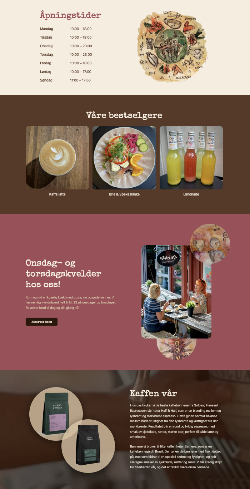
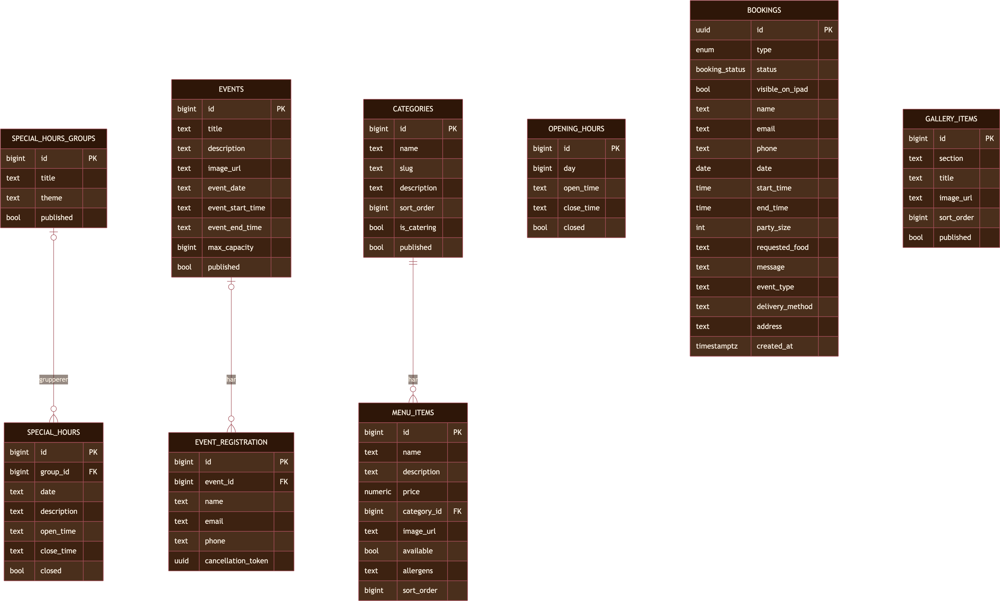

<!-- markdownlint-disable MD033 MD041 -->

# Kokeliko


Nettsiden til Kokeliko Kaffebar på Bærums Verk, med offentlige sider (meny, booking, arrangementer, om oss) og et adminpanel for å drifte innholdet.

Designet, utviklet og driftet av meg alene, fra idé til live produksjonsside.

**Live:** [kokeliko.no](https://kokeliko.no)

Bygget med [Next.js](https://nextjs.org) (App Router, Turbopack), [Tailwind CSS v4](https://tailwindcss.com), [Supabase](https://supabase.com) (database, autentisering, filopplasting) og [Resend](https://resend.com) (e-post). Driftes på [Vercel](https://vercel.com).

<br clear="left" />

## Utdrag fra UI

<p>
  
  
</p>

<!-- markdownlint-enable MD033 MD041 -->

## Funksjonalitet

- **Offentlig side**: meny (inkl. catering-meny), booking (bordreservasjon, catering, lukket selskap), arrangementer med på-/avmelding, om oss
- **Adminpanel** (`/admin`): innlogging via Supabase Auth med en tillatelisliste; drifter meny, åpningstider, bookinger, arrangementer og forsidegalleri
- **iPad-booking** (`/bookingipad`): forenklet, skrivebeskyttet bookingoversikt for en iPad i baren, med egen, separat innlogging
- **Automatisk e-post** via Resend: bekreftelser, avmeldingslenker og varsler til ansatte ved nye bookinger/arrangementer
- **Beskyttede ruter**: en Next.js-proxy (`src/proxy.ts`) håndhever innlogging og sender uinnloggede til riktig login-side

## Kom i gang lokalt

> Krever et Supabase-prosjekt med tilsvarende tabeller (skjemaet er ikke inkludert i dette repoet, siden endringer gjøres direkte i Supabase i stedet for via sporede migrasjoner) og en Resend-konto. Uten disse vil siden ikke starte, siden Supabase-klienten kaster en feil ved oppstart om nøklene mangler.

```bash
npm install
npm run dev
```

Åpne [http://localhost:3000](http://localhost:3000).

### Miljøvariabler

Opprett en `.env`-fil i prosjektroten med:

| Variabel | Beskrivelse |
| --- | --- |
| `NEXT_PUBLIC_SUPABASE_URL` | Supabase-prosjektets URL (Settings → API) |
| `NEXT_PUBLIC_SUPABASE_ANON_KEY` | Supabase sin offentlige anon-nøkkel |
| `SUPABASE_SERVICE_ROLE_KEY` | Supabase sin service role-nøkkel, kun brukt server-side, aldri eksponert til nettleseren. Hold hemmelig |
| `RESEND_API_KEY` | API-nøkkel fra Resend, brukes til all utsendt e-post |
| `CONTACT_EMAIL` | E-postadressen som skal motta bookingforespørsler (`elin@kokeliko.no` i produksjon) |
| `NEXT_PUBLIC_SITE_URL` | Nettsidens fulle URL, brukes i lenker i e-poster (f.eks. avmeldingslenker) |

## Datamodell

> Skjemaet spores ikke i dette repoet; endringer gjøres direkte i Supabase. Diagrammet under er et øyeblikksbilde hentet fra en faktisk skjemadump, og kan avvike fra det virkelige skjemaet over tid etter hvert som det endres.



I tillegg finnes en `images`-bøtte i Supabase Storage for opplastede bilder (galleri, meny, arrangementer), separat fra disse tabellene.

### Tilgangsstyring (Row Level Security)

Alle tabeller har RLS aktivert i Supabase:

- **Offentlig lesing** av alt publisert innhold (åpningstider, kategorier, menyelementer, galleri, arrangementer): den offentlige anon-nøkkelen i frontend-koden kan kun lese, aldri skrive.
- **Skriving krever innlogging**, og hver skrive-policy utelukker i tillegg iPad-kontoen (`ipad@kokeliko.no`) spesifikt, så iPad-oversikten er dermed skrivebeskyttet på databasenivå, ikke bare i UI-et.
- **Arrangementspåmelding** tillater offentlig innsending (`INSERT`), men ingen offentlig lesing, endring eller sletting av andres påmeldinger.
- **Bookinger** har ingen offentlige policyer i det hele tatt. Bookingskjemaene sender i stedet til `/api/send-email`, som bruker Supabase sin service role-nøkkel server-side for å lagre bookingen. Den offentlige anon-nøkkelen har aldri direkte tilgang til denne tabellen. Innloggede ansatte kan lese alle bookinger, mens kun ikke-iPad-kontoer kan opprette, endre og slette dem.

## Arkitektur

```text
src/
├─ app/
│  ├─ (public)/           Offentlige sider: forsiden, meny, booking, arrangementer, om oss
│  ├─ arrangementer/avmeld/  Selvbetjent avmelding fra arrangement (lenke i e-post)
│  ├─ admin/               Adminpanel (meny, åpningstider, bookinger, arrangementer, galleri), krever innlogging
│  ├─ bookingipad/         Forenklet booking-oversikt for iPad i baren, som krever innlogging med egen konto
│  └─ api/                 API-ruter: e-postutsendelse, avmelding, arrangement-oppdateringer
├─ components/             Delte UI-komponenter (navbar, forsideseksjoner)
├─ lib/                    Supabase-klienter, validering, delt e-postlogikk
└─ proxy.ts                Beskytter /admin- og /bookingipad-rutene og redirecter uinnloggede til riktig login-side
```
