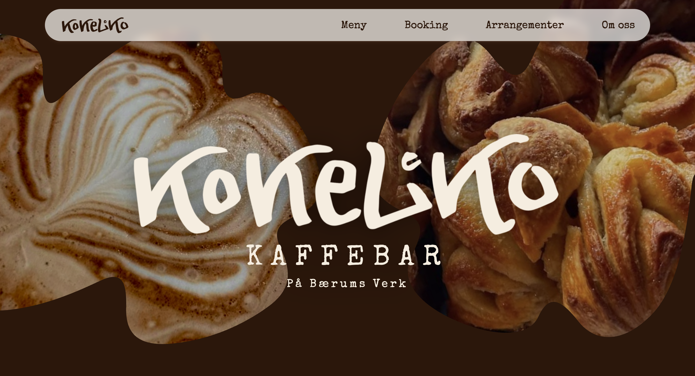

<!-- markdownlint-disable MD033 MD041 -->


# Kokeliko

Nettsiden til Kokeliko Kaffebar på Bærums Verk — offentlige sider (meny, booking, arrangementer, om oss) og et adminpanel for å drifte innholdet.

**Live:** [kokeliko.no](https://kokeliko.no)

Bygget med [Next.js](https://nextjs.org) (App Router, Turbopack), [Tailwind CSS v4](https://tailwindcss.com), [Supabase](https://supabase.com) (database, autentisering, filopplasting) og [Resend](https://resend.com) (e-post).

<br clear="left" />

## Skjermbilde

<p>
  
</p>

<!-- markdownlint-enable MD033 MD041 -->

## Kom i gang lokalt

```bash
npm install
npm run dev
```

Åpne [http://localhost:3000](http://localhost:3000).

## Miljøvariabler

Opprett en `.env`-fil i prosjektroten med:

| Variabel | Beskrivelse |
| --- | --- |
| `NEXT_PUBLIC_SUPABASE_URL` | Supabase-prosjektets URL (Settings → API) |
| `NEXT_PUBLIC_SUPABASE_ANON_KEY` | Supabase sin offentlige anon-nøkkel |
| `SUPABASE_SERVICE_ROLE_KEY` | Supabase sin service role-nøkkel — kun brukt server-side, aldri eksponert til nettleseren. Hold hemmelig |
| `RESEND_API_KEY` | API-nøkkel fra Resend, brukes til all utsendt e-post |
| `CONTACT_EMAIL` | E-postadressen som skal motta bookingforespørsler (`elin@kokeliko.no` i produksjon) |
| `NEXT_PUBLIC_SITE_URL` | Nettsidens fulle URL, brukes i lenker i e-poster (f.eks. avmeldingslenker) |

## Prosjektstruktur

```text
src/
├─ app/
│  ├─ (public)/           Offentlige sider: forsiden, meny, booking, arrangementer, om oss
│  ├─ arrangementer/avmeld/  Selvbetjent avmelding fra arrangement (lenke i e-post)
│  ├─ admin/               Adminpanel (meny, åpningstider, arrangementer, galleri) — krever innlogging
│  └─ api/                 API-ruter: e-postutsendelse, avmelding, arrangement-oppdateringer
├─ components/             Delte UI-komponenter (navbar, forsideseksjoner)
├─ lib/                    Supabase-klienter, validering, delt e-postlogikk
└─ proxy.ts                Beskytter /admin-rutene — redirecter uinnloggede til /admin/login
```

## Admin

`/admin/login` — innlogging skjer med e-post/passord via Supabase Auth. Brukere opprettes manuelt i Supabase → Authentication → Users. Alle innloggede brukere har identisk full tilgang til hele adminpanelet (ingen rollestyring).

Fra adminpanelet kan man administrere:

- **Meny** — kategorier og retter
- **Åpningstider** — faste og spesielle åpningstider
- **Arrangementer** — opprette, redigere, avlyse, og sende oppdateringer til påmeldte
- **Galleri** — bilder til forsiden

## Deploy

Siden er satt opp for å kjøre på [Vercel](https://vercel.com), koblet direkte til dette repoet. Alle miljøvariablene over må også legges inn i Vercel-prosjektets innstillinger (Production og Preview).
